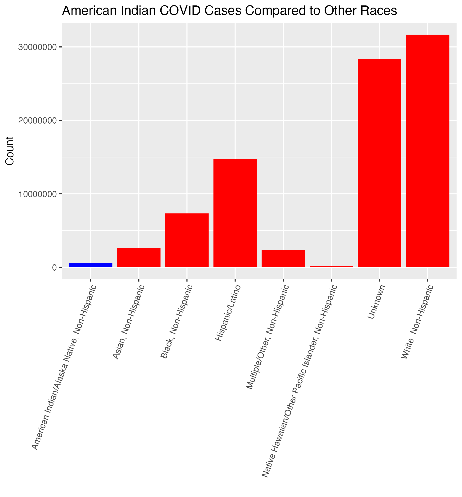

## Project thoughts

I am interested in exploring data related to American Indian/Native American health disparities study conducted by the Urban Indian Health Institute (UIHI), which reported that these numbers vastly underrepresented the Native American Covid-19 crisis, because a limited number of US states calculated Native American Covid-19 cases and deaths. The UIHI study refers to the CDC erasure of AI/AN Covid cases as “data genocide,” and claims it is a form of systemic oppression. Additionally, some states recorded Native American cases as “white” or “other” rather than indigenous people --- coding for missing variables and also comparing CDC data to UIHI data would serve as a way to explore Native American/American Indian Covid disaparities. 

My Research Question is as follows: 

Are AI/AN (Native Americans) above the age of 50 more likely to be hospitalized as a result of Covid-19 White American over 50 years old? How are the mortality rates and hospitalization rates of these two groups related and where do they differ? 

My theory: 
Due to the systematic poor health system for Native Americans in the United States, called the Indian Health Service (IHS), is notably decentralized and often federally underfunded. According to “Medical Mistrust and Less Satisfaction With Health Care Among Native Americans Presenting for Cancer Treatment,” the NIH reports that Native Americans exhibit “higher medical mistrust and lower satisfaction with health care,” one factor that may contribute to the exacerbation of the Covid crisis in these communities. Additionally, that sentiment may be more prevalent in older generations of Native communities that dealt with more adverse and direct federal government oppression — making these individuals less likely to seek Covid treatment or healthcare from the IHS, a federally funded organization. I compare this group specifically because they are more likely to contract Covid and are at higher risk for Covid-19 complications. With the IHS providing notoriously less adequate healthcare to AI/AN people, I am looking specifically at how the IHS treated this older generation compared to White Americans treated for Covid. (I am aware that I could also take the study a step further and compare <50 years old AI/AN with >50 years old AI/AN, but for the purposes of the research question, I want to keep my objectives clear.) My theory is that the older generation of AI/AN individuals mortality rates from Covid are higher than White persons, while the hospitalization rates are lower due to the adverse attitudes towards hospitals in Native communities. 

Explanatory Variable: My unit of analysis is the demographic data including AI/AN individuals over the age of 50 and White individuals over the age of 50. The explanatory variables being dealt with are age and heritage – above 50 and then AI/AN or White. The outcome variable is to what extent these separate populations, separated by age, are hospitalized or die from Covid, depending on which direction I choose to take the study. This date is accessible within the CDC Covid Data Sets regarding AI/AN populations. However, one area of potential difficulty in this study would be the lack of reported data in certain states, namely Arizona, which has the largest Navajo population in the United States. If I could limit my analysis to one specific state such as New Mexico that has full reported data for AI/AN populations, the results may be more discernible. This specific data set looks at hospitalizations and mortality rates for New Mexican AI/AN populations in 2020. 

Furthermore, if I observe AI/AN individuals above the age of 50 being hospitalized more often than White individuals (with mortality rates the same as White persons or lower than White persons), my hypothesis would be disproven. If I observe AI/AN individuals experiencing higher mortality rates with lower hospitalization rates, my hypothesis would be proven correct. I could potentially code for regression and see if there is a positive correlation between AI/AN hospitalization vs White hospitalization rates. 



```{r}

library(tidyverse)

covid_new <- read_csv("~/Downloads/covid_data_jan21.csv")

# Separating county into two columns to get county name and state name separate
# Grouping by county, state, and category first so that we can calculate difference
# in daily reporting for those groups separate from one another
# We are creating a variable for the last reported date & its cases so that we can calculate difference
# over time
# Difference over time is the difference in cases from the last report divided by the difference in days from
# the last report

covid_new_w_state <- covid_new |>
  mutate(cumul_cases = `0`) |>
  separate(col = county_names, into = c("county", "state"), sep = ', ',
           extra = 'drop',
           fill = 'warn') %>%
  group_by(county, state, categories) |>
  mutate(last_date_reported = lag(dates),
         last_cases_reported = lag(cumul_cases)) |>
  ungroup() |>
  mutate(dif_days = as.numeric(dates - last_date_reported),
         dif_cases = cumul_cases - last_cases_reported,
         daily_change = dif_cases / dif_days) |>
  arrange(county, state, categories) 

covid_new_w_state %>%
  filter(state == 'Arizona') %>%
  filter(county == 'Apache County') %>%
  ggplot() +
  geom_line(aes(x = dates, y = dif_cases, color = categories))

covid_new_w_state %>%
  filter(state == 'Arizona') %>%
  filter(county == 'Navajo County') %>%
  ggplot() +
  geom_line(aes(x = dates, y = dif_cases, color = categories))

covid_new_w_state %>%
  filter(state == 'Arizona') %>%
  filter(county == 'Yavapai County') %>%
  ggplot() +
  geom_line(aes(x = dates, y = dif_cases, color = categories))

```

```{r}

AZ_county_dems <- read_csv("~/Downloads/cc-est2021-alldata-04.csv") |>
  filter(YEAR == 2,
         AGEGRP == 0)

unique(covid_new_w_state$categories)

AZ_covid <- covid_new_w_state %>%
  filter(state == 'Arizona')

# _pc means per 100k race population

AZ_covid_w_dems <- inner_join(AZ_covid, AZ_county_dems, by = c("county" = "CTYNAME")) |>
  mutate(race_population = case_when(
    categories == "american_indian_alaska_native"  ~ IA_MALE + IA_FEMALE,
    categories == "asian" ~ AA_MALE + AA_FEMALE,
    categories == "black_african_american" ~ BA_MALE + BA_FEMALE,
    categories == "cumulative_cases" ~ TOT_POP,
    categories == "hispanic_(all_races)" ~ H_MALE + H_FEMALE,
    categories == "non-hispanic" ~ NH_MALE + NH_FEMALE,
    categories == "other"  ~ TOT_POP,
    categories == "unknown" ~ TOT_POP,
    categories == "white" ~ WA_MALE + WA_FEMALE,
    categories == "2+_races" ~ TOM_MALE + TOM_FEMALE,
    categories == "native_hawaiian_pacific_islander" ~ NA_MALE + NA_FEMALE,
    categories ==  "not_specified" ~ TOT_POP
  )) |>
  mutate(race = categories) |>
  select(county, state, dates, race, cumul_cases, dif_days, dif_cases, daily_change, race_population) |>
  mutate(cumul_cases_pc = 100000 * cumul_cases / race_population,
         dif_cases_pc = 100000 * dif_cases / race_population,
         daily_change_pc = 100000 * daily_change / race_population)
```


```{r}

AZ_covid_w_dems %>%
  filter(county == 'Apache County') |>
  filter(race %in% c("american_indian_alaska_native", "white", "unknown")) |>
  ggplot() +
  geom_line(aes(x = dates, y = dif_cases_pc, color = race))

AZ_covid_w_dems %>%
  filter(county == 'Navajo County') %>%
  filter(race %in% c("american_indian_alaska_native", "white", "unknown")) |>
  ggplot() +
  geom_line(aes(x = dates, y = dif_cases_pc, color = race))

AZ_covid_w_dems %>%
  filter(county == 'Yavapai County') %>%
  filter(race %in% c("american_indian_alaska_native", "white", "unknown")) |>
  ggplot() +
  geom_line(aes(x = dates, y = dif_cases_pc, color = race))

```

```{r}

# On January 3, the difference in the per capita difference in reporting for White and AI/AN individuals was:
12.101166 - 48.339203

AZ_covid_w_dems %>%
  filter(county == 'Apache County') |>
  filter(race %in% c("american_indian_alaska_native", "white", "unknown")) |>
  ggplot() +
  geom_line(aes(x = dates, y = cumul_cases_pc, color = race))

AZ_covid_w_dems %>%
  filter(county == 'Navajo County') %>%
  filter(race %in% c("american_indian_alaska_native", "white", "unknown")) |>
  ggplot() +
  geom_line(aes(x = dates, y = cumul_cases_pc, color = race))

AZ_covid_w_dems %>%
  filter(county == 'Yavapai County') %>%
  filter(race %in% c("american_indian_alaska_native", "white", "unknown")) |>
  ggplot() +
  geom_line(aes(x = dates, y = cumul_cases_pc, color = race))

```

